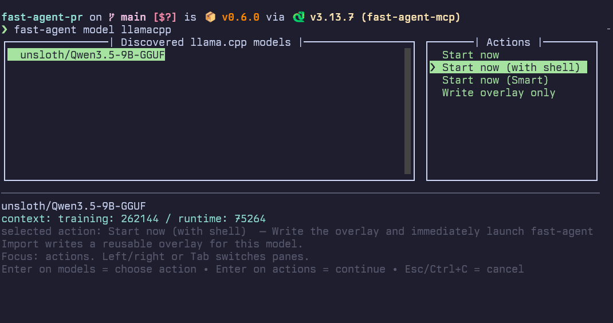

# Code with HF Inference Providers and llama.cpp

Use the latest open weight models via Hugging Face Inference Providers:

```bash
uvx fast-agent-mcp@latest --pack hf-dev
```

This starts **fast-agent** pre-configured with a coding agent and filesystem search sub-agent. 

By default you will be prompted for the coding model to use, with `gpt-oss-120b` used for search.  

To change these defaults use:

```bash
uvx fast-agent-mcp@latest model setup
```

The agent has a minimal system prompt set of tools for accessing the shell, filesystem and **fast-agent** services. The system prompt includes `AGENTS.md` if present. Customise the agent by modifying  `.fast-agent/agent-cards/dev.md`

Use `/skills` to discover, add, remove and update skills. Use `/connect` to connect to MCP Servers. 

Use the `compaction-strategies` skill to set up your preferred compaction scheme (if any). 

## Installation

**fast-agent** requires Python 3.13 or above. Install with:

```bash
uv tool install -U fast-agent-mcp
```

Or a specific version of Python:

```bash
uv tool install --python 3.13 -U fast-agent-mcp
```

This installs the `fast-agent` executable.

## llama.cpp

To use models hosted locally with [`llama.cpp`](https://llama-cpp.com/), start `llama-server` with your chosen model and then run:

```bash
fast-agent model llamacpp
```

This reads the correct model parameters (e.g. context window size) from the `llama.cpp` server, and configures the `fast-agent` model settings correctly.



Create a [model overlay](../models/model_overlays.md) file for future use, or start immediately with "Start now".

## Export agent traces to Hugging Face datasets

Persisted sessions can be exported as Codex-style JSONL traces and uploaded directly
to a Hugging Face dataset repo.

From inside `fast-agent`:

```text
/session export latest --hf-dataset your-name/fast-agent-traces
/session export latest --hf-dataset your-name/fast-agent-traces --hf-dataset-path evals/
```

From the shell:

```bash
fast-agent export latest --hf-dataset your-name/fast-agent-traces
fast-agent export latest --output trace.jsonl --hf-dataset your-name/fast-agent-traces
```

Notes:

- Traces come from persisted sessions, so `--noenv` runs are not exportable.
- If you omit `--output`, fast-agent writes a default file named
  `{session_id}__{agent_name}__codex.jsonl` in the current directory before upload.
- `--hf-dataset-path` can be either a file path or a folder path. If it ends with `/`,
  fast-agent appends the local filename.
- Uploads require `huggingface_hub`. The dataset repo is created automatically if it
  does not already exist.

For the full CLI reference, see [fast-agent export](../ref/export_command/).
