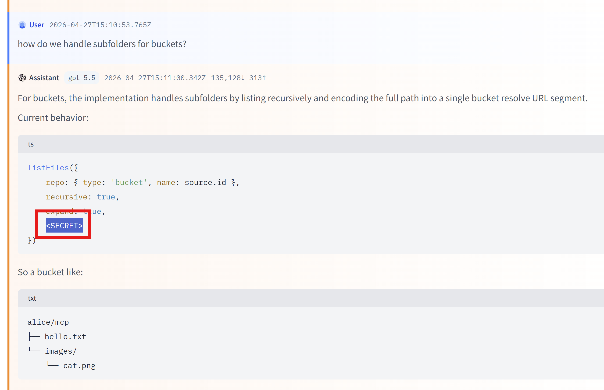

# OpenAI Privacy Filter Session Export

`fast-agent export --privacy-filter` redacts likely private data from exported
session traces before the JSONL file is written locally or uploaded to a Hugging
Face dataset. 

Use it when you want to share a trace for debugging, evals, or dataset review but
want a safer default than exporting raw prompts, messages, and tool output.

!!! warning "Best-effort redaction"

    Privacy filtering is a local data-minimisation aid, not anonymisation and not
    a compliance guarantee. It can miss private data and can redact benign text.
    Review sanitized exports before sharing them.

## Quick start

Install fast-agent with the optional privacy dependencies:

```bash
uv tool install -U "fast-agent-mcp[privacy]"
```



Then export with filtering enabled:

```bash
fast-agent export latest --privacy-filter --output sanitized-trace.jsonl
```

On the first run, the OpenAI Privacy Filter model must already be in your local
Hugging Face cache. To allow the download explicitly, add
`--download-privacy-filter`:

```bash
fast-agent export latest \
  --privacy-filter \
  --download-privacy-filter \
```

The default model download [`openai/privacy-filter`](https://huggingface.co/openai/privacy-filter) is about 1.5 GB. Future exports reuse the cached files.

## What happens during export

With `--privacy-filter`, fast-agent:

1. checks that the optional privacy dependencies are installed;
2. resolves the OpenAI Privacy Filter ONNX model locally, or downloads it when
   `--download-privacy-filter` is set;
3. scans exported text content locally with ONNX Runtime;
4. writes a valid Codex-style JSONL trace with replacements such as
   `<PRIVATE_EMAIL>`, `<PRIVATE_PERSON>`, and `<SECRET>`;
5. prints a compact summary of redaction counts.

Example summary:

```text
Privacy filter redacted 12 text span(s) in 4.3s:
  private_email: 3
  private_person: 4
  secret: 5
```

The default output filename also changes so sanitized files are easy to spot:

```text
{session_id}__{agent_name}__codex-privacy.jsonl
```

Unfiltered exports continue to use:

```text
{session_id}__{agent_name}__codex.jsonl
```

## Export examples

Write a sanitized trace locally:

```bash
fast-agent export latest --privacy-filter
```

Write to a specific file:

```bash
fast-agent export latest \
  --privacy-filter \
  --output sanitized-trace.jsonl
```

Download the model if it is not cached yet:

```bash
fast-agent export latest \
  --privacy-filter \
  --download-privacy-filter
```

Use a model snapshot you already downloaded:

```bash
fast-agent export latest \
  --privacy-filter \
  --privacy-filter-path ~/.cache/huggingface/hub/path/to/snapshot
```

Upload the sanitized file to a Hugging Face dataset:

```bash
fast-agent export latest \
  --privacy-filter \
  --hf-dataset your-name/fast-agent-traces
```

Upload into a folder in the dataset repo:

```bash
fast-agent export latest \
  --privacy-filter \
  --hf-dataset your-name/fast-agent-traces \
  --hf-dataset-path sanitized/
```

Privacy filtering runs before upload. The uploaded file is the sanitized JSONL
file written by the export step.

## Interactive command

Inside the interactive prompt, use `/session export` with the same options:

```text
/session export latest --privacy-filter
/session export latest --privacy-filter --output sanitized-trace.jsonl
/session export latest --privacy-filter --hf-dataset your-name/fast-agent-traces
```

## Options

| Option | What it does |
| --- | --- |
| `--privacy-filter` | Enable local privacy filtering. Required for all other privacy options. |
| `--download-privacy-filter` | Allow fast-agent to download the default model if it is not cached. |
| `--privacy-filter-path <path>` | Use a local OpenAI Privacy Filter model snapshot directory. |
| `--privacy-filter-device auto\|cpu\|cuda` | Choose the ONNX Runtime device. Defaults to `auto`. |
| `--privacy-filter-variant q4\|q4f16\|q8\|fp16` | Choose the model variant. Defaults to `q8`. |
| `--privacy-filter-quant ...` | Alias for `--privacy-filter-variant`. |
| `--show-redactions` | Print detected labels and original snippets to stderr for local review. Do not use when logs are shared. |

The default model is:

```text
openai/privacy-filter @ 7ffa9a043d54d1be65afb281eddf0ffbe629385b
```

The default variant is `q8`, which is a good CPU default. If you do not specify a
variant and `q8` is not cached, fast-agent can reuse another cached variant
(`q4`, `q4f16`, or `fp16`) instead of forcing a re-download. If you specify a
variant explicitly, that exact variant must be present or downloadable.

CUDA users can try `q4f16` or `fp16` explicitly:

```bash
fast-agent export latest \
  --privacy-filter \
  --privacy-filter-device cuda \
  --privacy-filter-variant q4f16
```

## What is filtered

The privacy filter is applied to text-bearing parts of the exported Codex JSONL
trace, including:

- base instructions and system/developer prompt text included in the export
- user messages
- assistant messages
- assistant reasoning summaries
- tool-call argument strings
- tool result text
- embedded text resources
- turn summaries such as user event text and last assistant message

The export remains structurally valid JSONL. IDs, timestamps, model/provider
fields, tool names, call IDs, session metadata paths and other structural fields
are preserved.

Large text blocks are scanned in bounded token windows, so tool outputs and logs
do not need to fit into one model call. Advanced users can tune the window size:

```bash
FAST_AGENT_PRIVACY_FILTER_MAX_WINDOW_TOKENS=4096
FAST_AGENT_PRIVACY_FILTER_WINDOW_OVERLAP_TOKENS=128
```

## What is not filtered

The privacy filter does not redact every structural or binary field. In
particular, review traces that include:

- file paths, directory names, and filenames
- resource URLs, file URLs, or image URLs
- image data
- audio data
- embedded base64 file data
- non-text payloads

If a filename, URL, or MIME type is included inside a larger generated text block,
that text block is scanned. Standalone structural attachment fields are preserved.

## Troubleshooting

### Missing dependencies

If the privacy extra is not installed, export fails before model lookup and lists
the missing packages. Install with:

```bash
uv pip install "fast-agent-mcp[privacy]"
# or
pip install "fast-agent-mcp[privacy]"
```

For a `uv tool` install, reinstall or upgrade the tool with the privacy extra:

```bash
uv tool install -U "fast-agent-mcp[privacy]"
```

### Model is not cached

By default fast-agent will not start a surprise 1 GB download. Run again with:

```bash
fast-agent export latest --privacy-filter --download-privacy-filter
```

or provide a local model directory:

```bash
fast-agent export latest --privacy-filter --privacy-filter-path /path/to/model
```

### Review what was redacted

For local-only debugging, add `--show-redactions`:

```bash
fast-agent export latest --privacy-filter --show-redactions
```

This prints detected labels and original snippets to stderr. Do not enable it in
CI or in logs you plan to share.

## Trace metadata

Sanitized exports include privacy-filter metadata on the first `session_meta`
record. The metadata records that filtering was applied, which backend/model was
used, known limitations, and redaction counts:

```json
{
  "privacy_filter": {
    "applied": true,
    "mode": "content-only",
    "backend": "onnxruntime",
    "model": {
      "repo_id": "openai/privacy-filter",
      "revision": "7ffa9a043d54d1be65afb281eddf0ffbe629385b",
      "variant": "q8"
    },
    "redactions": {
      "total": 12,
      "by_label": {
        "private_person": 4,
        "private_email": 3,
        "secret": 5
      },
      "elapsed_seconds": 4.321
    },
    "limitations": [
      "file_paths_not_redacted",
      "directory_names_not_redacted",
      "filenames_not_redacted",
      "resource_urls_not_redacted",
      "binary_payloads_not_redacted",
      "images_audio_not_redacted"
    ]
  }
}
```

## Related reference

- [`fast-agent export`](../ref/export_command/)
- [Hugging Face Agent Trace Viewer](https://huggingface.co/changelog/agent-trace-viewer)
