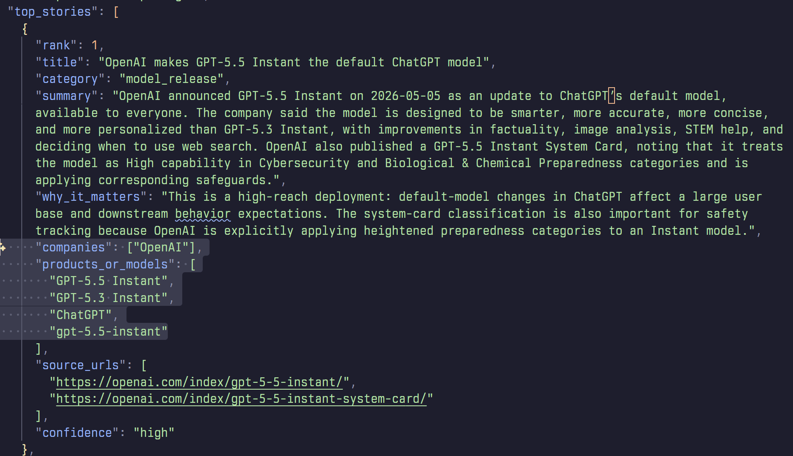
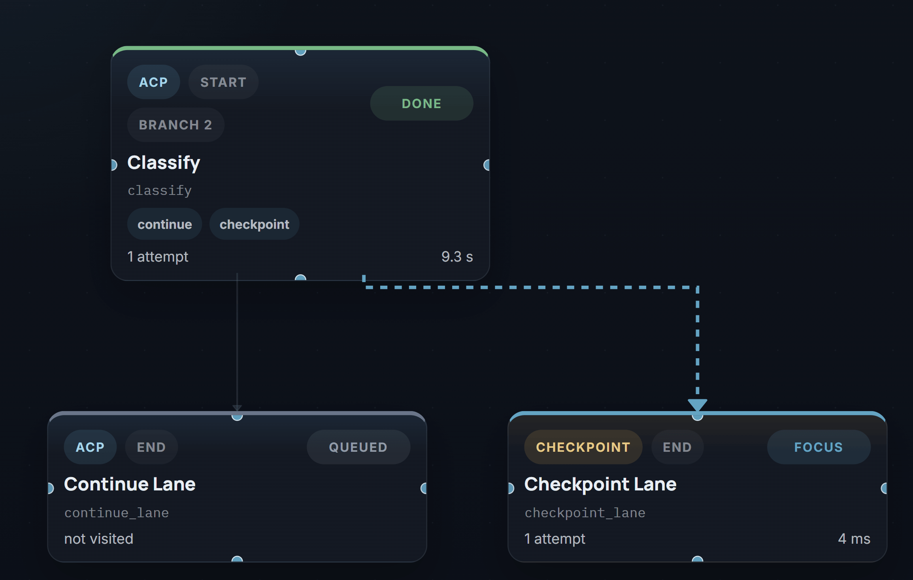

# Structured Outputs

**`fast-agent`** supports structured JSON generation using Schemas or Pydantic Models. 

The best technique for producing an output is automatically used depending on the chosen model and provider. See [Using Tools with Structured Outputs](#using-tools-with-structured-outputs) for advanced configuration.

## CLI 

**`fast-agent`** generates Structured Outputs from the CLI by specifying either a JSON Schema or Pydantic Model. 

Use the `--json-schema` option to supply a schema path or URI, and prompt with `--message <TEXT>` or `--prompt-file <PATH_OR_URI>`.

=== "bash"

    ```bash
    fast-agent \
    --model gpt-5.5 \
    --json-schema ./book-recommendations.json \
    --message "recommend me some science fiction books"
    ```

=== "book-recommendations.json"

    ```json title="book-recommendations.json"
    {
    "$schema": "https://json-schema.org/draft/2020-12/schema",
    "title": "RecommendationCollection",
    "type": "object",
    "properties": {
        "recommendations": {
        "type": "array",
        "items": {
            "type": "object",
            "properties": {
            "title": {
                "type": "string"
            },
            "author": {
                "type": "string"
            },
            "genre": {
                "type": "string"
            },
            "publicationYear": {
                "type": "integer",
                "minimum": 0
            }
            },
            "required": ["title", "author", "genre", "publicationYear"],
            "additionalProperties": false
        }
        }
    },
    "required": ["recommendations"],
    "additionalProperties": false
    }
    ```


To use a Pydantic Model:

=== "bash"

    ```bash
    PYTHONPATH=$PWD fast-agent --model gpt-5.5 \
    --schema-model pydantic_books:RecommendationCollection \
    --message "recommend me some science fiction books"
    ```


=== "pydantic_books.py"

    ```python title="pydantic_books.py"
    from pydantic import BaseModel, ConfigDict, Field

    class BookRecommendation(BaseModel):
        model_config = ConfigDict(extra="forbid", populate_by_name=True)

        title: str
        author: str
        genre: str
        publication_year: int = Field(alias="publicationYear", ge=0)


    class RecommendationCollection(BaseModel):
        model_config = ConfigDict(extra="forbid")

        recommendations: list[BookRecommendation]
    ```

Structured Outputs can be used with Tools, custom System Prompts (with `--instruction`) or Agent Cards (`--card`):

```bash
fast-agent go \
  --model gpt-5.5 \
  --card review-agent.md \
  --shell \
  --json-schema ./code-review.schema.json \
  --message "Review the current repository branch for uncommitted changes and \
differences from main. Identify the main features and assess their size, risk \
and touched files."
```

Many items can be loaded from remote sources (`http` or `hf://` URIs), making **`fast-agent`** perfect for zero install automation and orchestration:

```bash
uvx fast-agent-mcp@latest \
  --card hf://buckets/evalstate/demo-bucket/ai-news-summary-card.md \
  --json-schema hf://buckets/evalstate/demo-bucket/ai-news-schema.json \
  --message "Summarize the AI Industry news for the last 24 hours"
```




Browse the example files [here](https://huggingface.co/buckets/evalstate/demo-bucket)

## API

The **`fast-agent`** API supports using either a Pydantic Model or JSON Schema:

=== "Pydantic"

    ```python title="structured_pydantic.py"
    import asyncio

    from pydantic import BaseModel

    from fast_agent import FastAgent


    class CityInfo(BaseModel):
        name: str
        country: str
        population: int
        landmarks: list[str]


    fast = FastAgent("Pydantic Model Example", quiet=True)

    @fast.agent("city", instruction="Return accurate tourist information.")
    async def main() -> None:
        async with fast.run() as agent:
            result, _ = await agent.city.structured(
                "Tell me about Paris",
                CityInfo,
            )

        if result is not None:
            print(result.model_dump_json(indent=2))


    if __name__ == "__main__":
        asyncio.run(main())

    ```

=== "Schema"

    ```python title="structured_schema.py"
    import asyncio
    import json

    from fast_agent import FastAgent
    from fast_agent.core.prompt import Prompt
    from fast_agent.llm.request_params import RequestParams


    CITY_INFO_SCHEMA = """
    {
    "type": "object",
    "properties": {
        "name": {
        "type": "string"
        },
        "country": {
        "type": "string"
        },
        "population": {
        "type": "integer"
        },
        "landmarks": {
        "type": "array",
        "items": {
            "type": "string"
        }
        }
    },
    "required": ["name", "country", "population", "landmarks"],
    "additionalProperties": false
    }
    """


    fast = FastAgent("schema text generate example", quiet=True)


    @fast.agent("city", instruction="Return accurate tourist information.")
    async def main() -> None:
        schema = json.loads(CITY_INFO_SCHEMA)

        async with fast.run() as agent:
            message = await agent.city.generate(
                "Tell me about Paris",
                request_params=RequestParams(structured_schema=schema),
                # supply the schema with request_params
            )

            result = json.loads(message.last_text() or "{}")
            print(json.dumps(result, indent=2, ensure_ascii=False))


    if __name__ == "__main__":
        asyncio.run(main())

    ```

## ACP (Agent Client Protocol)

**`fast-agent`** supports an experimental ACP capability (co.huggingface.structuredOutput) for generating Structured Outputs via ACP. 

The capability is advertised as follows:

```json 
{
  "jsonrpc": "2.0",
  "id": 0,
  "result": {
    "protocolVersion": 1,
    "agentCapabilities": {
      "promptCapabilities": {
        "image": true,
        "embeddedContext": true
      },
      "_meta": {
        "co.huggingface": {
          "structuredOutput": true
        }
      }
    }
  }
}
```

Clients can request a Structured Output conforming to a schema by passing the following `_meta`:

```json
{
  "co.huggingface": {
    "structuredOutput": {
      "schema": { "...": "..." },
      "mode": "bestEffort"
    }
  }
}
```

**`fast-agent`** will then return generated JSON within the normal ACP TextContent response.



This feature is compatible and tested with this fork of ACPX: [https://github.com/evalstate/acpx](https://github.com/evalstate/acpx)

## Using Tools with Structured Outputs

From **`fast-agent 0.7.0`**, Tool Calls and Structured Outputs are combined in a single User turn for supported models.

For models that don't support both in a single turn, the default is to disable tools in calls with a structured output. 

This can be overridden by setting the `structured-tool-policy`. The policy can be set through a command line flag, or on RequestParams. Available policies are:

| Policy     | Behaviour                                                                       |
| ---------- | ------------------------------------------------------------------------------- |
| `auto`     | Use configuration in the Model Database                                         |
| `no_tools` | Do not send Tool Definitions when producing a Structured Output                 |
| `always`   | Force sending Tool Definitions when producing a Structured Output               |
| `defer`    | Use a two-phase call; first call with Tools, second to create Structured Output |

To set with the CLI, use `--structured-tool-policy` alongside `--json-schema`:

```bash
fast-agent go \
  --model gpt-5.5 \
  --shell \
  --json-schema ./code-review.schema.json \
  --structured-tool-policy defer \
  --message "Review the current repository branch for uncommitted changes and \
differences from main. Identify the main features and assess their size, risk \
and touched files."
```

NB: `--shell` exposes the local shell tool. 

## Model Support

### Confirmed Tools + Structured Capable

The following models are recommended for single-pass Tools + Structured output.

| provider  | model alias    | resolved model           | policy | pass | fail | failure rate |
| --------- | -------------- | ------------------------ | -----: | ---: | ---: | -----------: |
| Anthropic | `haiku`        | `claude-haiku-4-5`       | `auto` |   10 |    0 |           0% |
| Anthropic | `opus46`       | `claude-opus-4-6`        | `auto` |   10 |    0 |           0% |
| Anthropic | `opus`         | `claude-opus-4-7`        | `auto` |   10 |    0 |           0% |
| OpenAI    | `gpt55`        | `gpt-5.5`                | `auto` |   10 |    0 |           0% |
| OpenAI    | `gpt54`        | `gpt-5.4`                | `auto` |   10 |    0 |           0% |
| OpenAI    | `gpt54-mini`   | `gpt-5.4-mini`           | `auto` |   10 |    0 |           0% |
| OpenAI    | `codex`        | `gpt-5.3-codex`          | `auto` |   10 |    0 |           0% |
| xAI       | `grok`         | `grok-4.3`               | `auto` |   10 |    0 |           0% |
| Google    | `gemini3flash` | `gemini-3-flash-preview` | `auto` |   10 |    0 |           0% |

`claude-sonnet-4-6`, `gemini-3.1-flash-lite-preview` and `gemini-3.1-pro-preview` show elevated failure rates, so conduct your testing with your own schemas before finalizing a policy.

<!--
| provider | model alias | resolved model | policy | pass | fail | failure rate |
| Anthropic | `sonnet` | `claude-sonnet-4-6` | `defer` | 10 | 0 | 0% |
| Google | `gemini3.1pro` | `gemini-3.1-pro-preview` | `auto` | 5 | 5 | 50% |
| Google | `gemini3flash` | `gemini-3-flash-preview` | `defer` | 10 | 0 | 0% |
| Google | `gemini3.1flashlite` | `gemini-3.1-flash-lite-preview` | `defer` | 10 | 0 | 0% |
| Google | `gemini3.1flashlite` | `gemini-3.1-flash-lite-preview` | `auto` | 0 | 10 | 100% |

-->

For other models (including Hugging Face), use `--structured-tool-policy defer` if you know that the final result requires earlier Tool Calls.

### Remote Tools

Structured Outputs are compatible with Provider Hosted tools.

For xAI this includes `web_search` and `x_search`.

For OpenAI this includes `web_search` as well as the [other connectors](https://developers.openai.com/api/docs/guides/tools-connectors-mcp?quickstart-panels=connector#available-connectors) including Google, Outlook, Dropbox and more.

### Anthropic on Vertex

Anthropic Models on Vertex do not support modern structured outputs, so use the legacy `tool_use` mode. To select this mode supply the mode on the model string e.g. `haiku?structured_outputs=tool_use`.

### Capability Probe

The `fast-agent check structured` command allows you to probe the Structured Output capabilities of a model.

The probe uses a medium-complexity order-readiness schema with nested objects,
arrays, enums, numeric constraints, required fields, and `additionalProperties:
false`.

It runs 3 test cases in order:

- Direct JSON Schema
- Pydantic Model 
- Combined Tool and Structured Outputs

This is helpful for diagnosing Structured Output issues or configuring local Model Overlay configurations.
