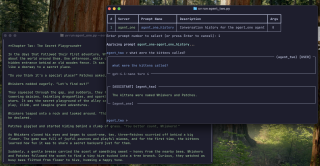
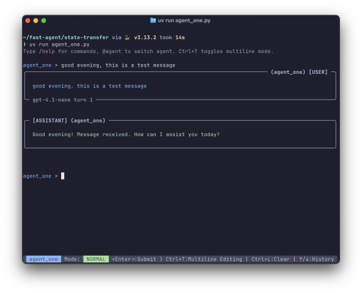
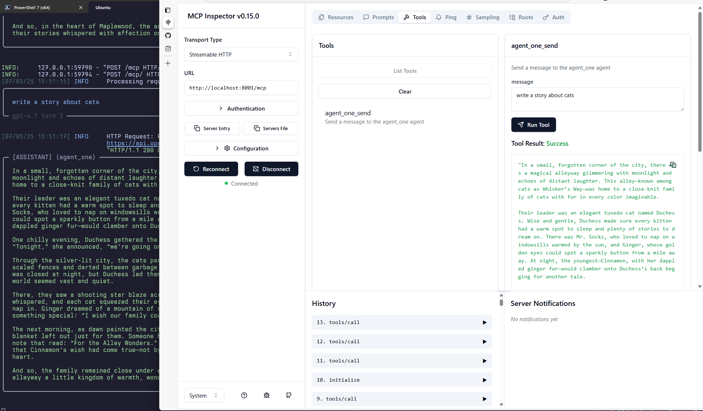
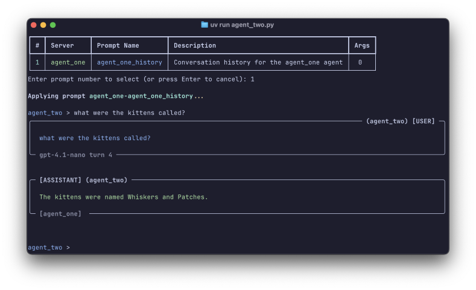
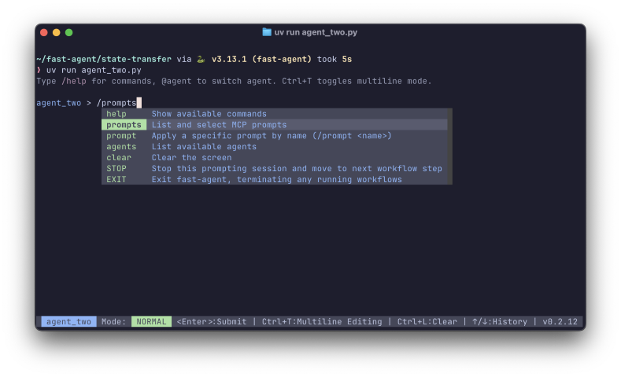

# Quick Start: State Transfer with MCP

In this quick start, we'll demonstrate how **fast-agent** can transfer state between two agents using MCP Prompts.

{: align=right }

First, we'll start `agent_one` as an MCP Server, and send it some messages with the MCP Inspector tool.

Next, we'll run `agent_two` and transfer the conversation from `agent_one` using an MCP Prompt.

Finally, we'll take a look at **fast-agent**'s `prompt-server` and how it can assist building agent applications

<!-- PICTURE OF INSPECTOR OR IMAGE HERE. -->

You'll need API Keys to connect to a [supported model](../models/llm_providers/), or use Ollama's [OpenAI compatibility](https://github.com/ollama/ollama/blob/main/docs/openai.md) mode to use local models.

The quick start also uses the MCP Inspector - check [here](https://modelcontextprotocol.io/docs/tools/inspector) for installation instructions.

## Step 1: Setup **fast-agent**

=== "Linux/MacOS"

    ```bash
    # create, and change to a new directory
    mkdir fast-agent && cd fast-agent

    # create and activate a python environment
    uv venv
    source .venv/bin/activate

    # setup fast-agent
    uv pip install fast-agent-mcp

    # create the state transfer example
    fast-agent quickstart state-transfer
    ```
=== "Windows"

    ```pwsh
    # create, and change to a new directory
    md fast-agent |cd

    # create and activate a python environment
    uv venv
    .venv\Scripts\activate

    # setup fast-agent
    uv pip install fast-agent-mcp

    # create the state transfer example
    fast-agent quickstart state-transfer
    ```

Change to the state-transfer directory (`cd state-transfer`), rename `fast-agent.secrets.yaml.example` to `fast-agent.secrets.yaml` and enter the API Keys for the providers you wish to use.

The supplied `fast-agent.yaml` file contains a default of `gpt-4.1` - edit this if you wish.

Finally, run `uv run agent_one.py` and send a test message to make sure that everything working. Enter `stop` to return to the command line.



## Step 2: Run **agent one** as an MCP Server

To start `"agent_one"` as an MCP Server, run the following command:

=== "Linux/MacOS"

    ```bash
    # start agent_one as an MCP Server:
    uv run agent_one.py --transport http --port 8001
    ```
=== "Windows"

    ```pwsh
    # start agent_one as an MCP Server:
    uv run agent_one.py --transport http --port 8001
    ```

The agent is now available as an MCP Server.

<!-- PICTURE OF STARTED SERVER HERE -->

!!! note

    This example starts the server on port 8001. To use a different port, update the URLs in `fast-agent.yaml` and the MCP Inspector.

## Step 3: Connect and chat with **agent one**

From another command line, run the Model Context Protocol inspector to connect to the agent:

=== "Linux/MacOS"

    ```bash
    # run the MCP inspector
    npx @modelcontextprotocol/inspector
    ```
=== "Windows"

    ```pwsh
    # run the MCP inspector
    npx @modelcontextprotocol/inspector
    ```

Choose the "Streamable HTTP" transport type, and the url `http://localhost:8001/mcp`. After clicking the `connect` button, you can interact with the agent from the `tools` tab. Use the `agent_one` tool to send the agent a chat message and see it's response.



The conversation history can be viewed from the `prompts` tab. Use the `agent_one_history` prompt to view it.

Disconnect the Inspector, then press `ctrl+c` in the command window to stop the process.

## Step 4: Transfer the conversation to **agent two**

We can now transfer and continue the conversation with `agent_two`.

Run `agent_two` with the following command:

=== "Linux/MacOS"

    ```bash
    # start agent_two as an MCP Server:
    uv run agent_two.py
    ```
=== "Windows"

    ```pwsh
    # start agent_two as an MCP Server:
    uv run agent_two.py
    ```

Once started, type `'/prompts'` to see the available prompts. Select `1` to apply the Prompt from `agent_one` to `agent_two`, transferring the conversation context.

You can now continue the chat with `agent_two` (potentially using different Models, MCP Tools or Workflow components).



<!-- PICTURE OF PROMPTS HERE -->

### Configuration Overview

**fast-agent** uses the following configuration file to connect to the `agent_one` MCP Server:

```yaml title="fast-agent.yaml"
# MCP Servers
mcp:
    servers:
        agent_one:
          transport: http
          url: http://localhost:8001/mcp
```

`agent_two` then references the server in it's definition:

```python title="agent_two.py" linenums="10" hl_lines="4"

# Define the agent
@fast.agent(name="agent_two",
            instruction="You are a helpful AI Agent",
            servers=["agent_one"])

async def main():
    # use the --model command line switch or agent arguments to change model
    async with fast.run() as agent:
        await agent.interactive()
```

## Step 5: Save/Reload the conversation

**fast-agent** gives you the ability to save and reload conversations.

Enter `***SAVE_HISTORY history.json` in the `agent_two` chat to save the conversation history as a JSON `{"messages": [...]}` container (fast-agent/MCP compatible).

You can also save it in a text format for easier editing.



By using the supplied MCP `prompt-server`, we can reload the saved prompt and apply it to our agent. Add the following to your `fast-agent.yaml` file:

```yaml title="fast-agent.yaml" linenums="23" hl_lines="4-6"
# MCP Servers
mcp:
    servers:
        prompts:
            command: prompt-server
            args: ["history.json"]
        agent_one:
          transport: http
          url: http://localhost:8001/mcp
```

And then update `agent_two.py` to use the new server:

```python title="agent_two.py" linenums="10" hl_lines="4"

# Define the agent
@fast.agent(name="agent_two",
            instruction="You are a helpful AI Agent",
            servers=["prompts"])

```

Run `uv run agent_two.py`, and you can then use the `/prompts` command to load the earlier conversation history, and continue where you left off.

Note that Prompts can contain any of the MCP Content types, so Images, Audio and other Embedded Resources can be included.

You can also use the [Playback LLM](../models/internal_models/) to replay an earlier chat (useful for testing!)
